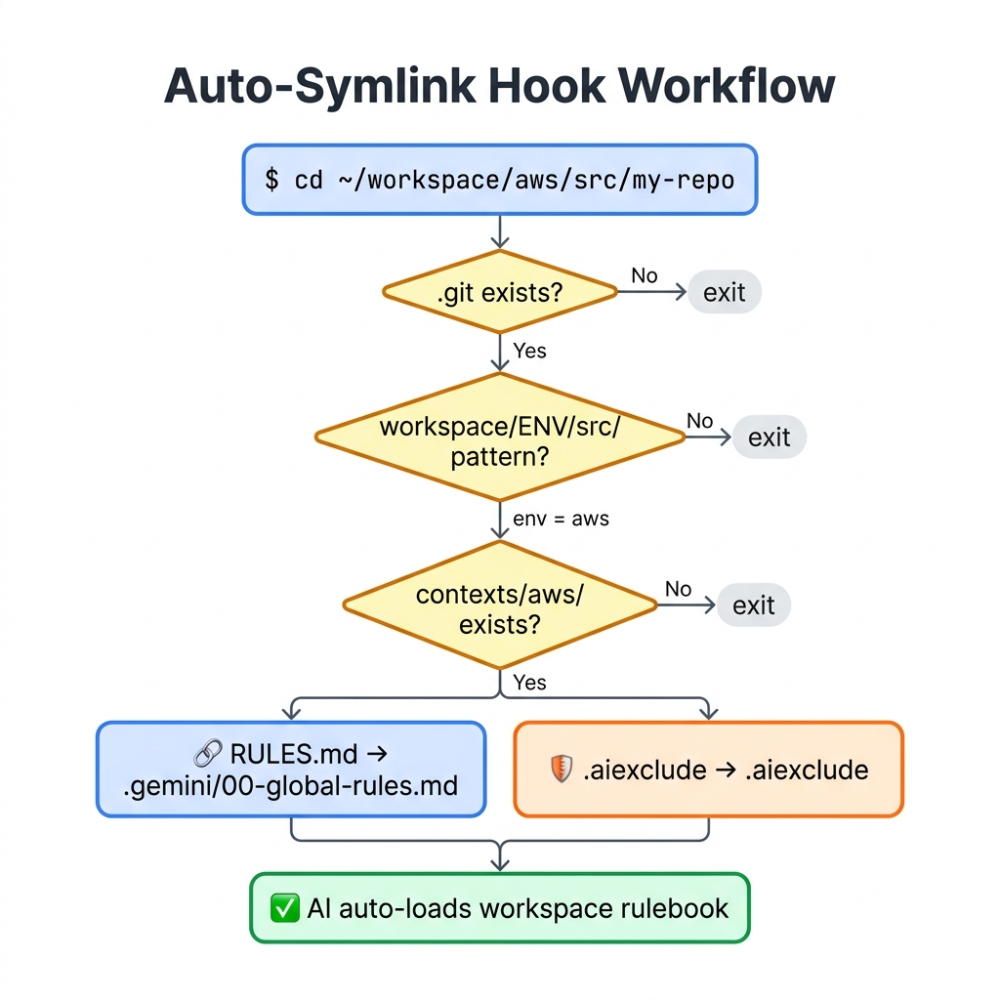
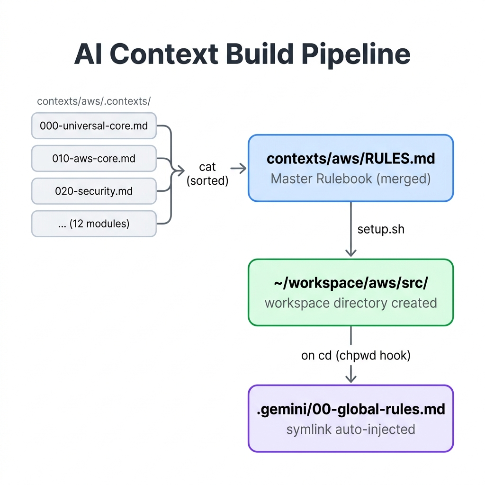

# Cloud Infrastructure Engineer Dotfiles & AI Brain

클라우드 인프라 엔지니어(Principal DevOps/SRE)를 위한 **로컬 작업 환경 자동 구성**과 **AI 자율 주행 프롬프트 아키텍처**를 하나의 레포지토리로 통합한 올인원 Dotfiles입니다.

단순 터미널 꾸미기를 넘어, **Zero-Trust 보안**, **도구 선언적 버전 관리**, 그리고 **AI(LLM)가 자율적으로 코드를 검증하고 인프라를 진단하는 에이전트 파이프라인**을 로컬 환경에 구축하는 것을 목표로 합니다.

---

## 목차

1. [설치 가이드](#설치-가이드)
2. [디렉토리 구조](#디렉토리-구조)
3. [핵심 기능](#핵심-기능)
4. [작동 논리 및 아키텍처](#작동-논리-및-아키텍처)
5. [포함된 도구 및 단축어](#포함된-도구-및-단축어)
6. [커스터마이징](#커스터마이징)

---

## 설치 가이드

> [!WARNING]
> **지원 OS**: Ubuntu / Debian 기반 Linux (또는 Windows WSL2 Ubuntu 환경)
> WSL2 사용 시, 반드시 Linux 네이티브 홈 디렉토리(`~/`) 하위에 클론하십시오. `/mnt/c/` 경로에서 실행하면 권한 오류가 발생하며 스크립트가 즉시 종료됩니다.

### Step 1. 저장소 클론

```bash
git clone https://github.com/iaminpwd/dotfiles.git ~/dotfiles
cd ~/dotfiles
```

### Step 2. 자동 설치 스크립트 실행

```bash
./setup.sh
```

스크립트는 다음 6단계를 순차적으로 실행합니다.

| 단계 | 작업 내용 |
|---|---|
| **[1/6]** 필수 패키지 설치 | `apt`로 git, zsh, stow, pipx, fd-find, dnsutils, tree 등 설치 |
| **[2/6]** Oh My Zsh 구성 | Oh My Zsh + `zsh-autosuggestions`, `zsh-syntax-highlighting` 플러그인 설치 |
| **[3/6]** Stow 심볼릭 링크 | 기존 설정 파일 백업 후, `zsh/vim/mise/git` 설정을 홈 디렉토리로 symlink |
| **[4/6]** mise 인프라 도구 설치 | `mise install`로 `mise.toml`에 선언된 40+ 데브옵스 도구 일괄 설치 |
| **[5/6]** AI 커스터마이징 구조 주입 | `contexts/*/` 순회하며 글로벌 룰(`AGENTS.md`) 셋업 및 워크스페이스별 `SKILL.md` 생성 |
| **[6/6]** 시크릿 보안 훅 | Trufflehog 기반 Git `pre-commit` 보안 스캔 훅 자동 구성 (시크릿 유출 원천 차단) |

### Step 3. 터미널 재시작

```bash
exec zsh
# 또는 기존 터미널에서: src
```

### 성공 검증 커맨드

```bash
# mise 도구 설치 확인
mise ls

# Stow symlink 확인
ls -la ~/.zshrc ~/.gitconfig ~/.mise.toml

# AI 컨텍스트 주입 확인
ls ~/workspace/aws/src && cat ~/.gemini/config/AGENTS.md | head -5

# 훅 동작 확인: aws workspace로 이동 후 확인
cd ~/workspace/aws/src
mkdir -p test-repo && cd test-repo && git init
ls -la .gemini/
```

---

## 디렉토리 구조

```text
~/dotfiles
├── contexts/             # AI 컨텍스트 룰북 단일 진실 공급원 (SSOT)
│   ├── 000-universal-core.md  # 전 워크스페이스 공통 마스터 엔진 (SSOT)
│   ├── README.md              # 프롬프트 아키텍처 백과사전
│   ├── aws/              # AWS 인프라 워크스페이스 룰북 🟢 Production
│   ├── aiops/            # AIOps (운영 자동화) 워크스페이스 🟡 Draft
│   ├── dotfiles/         # dotfiles 레포 자체 관리용 메타 프롬프트 🟢 Production
│   └── k8s/              # Kubernetes & Cloud Native 워크스페이스 🟡 Draft
│
├── git/
│   ├── .gitconfig        # 글로벌 Git 설정 (alias, pull.rebase=true)
│   └── .gitignore_global # 시스템 전역 Git 무시 규칙 (tfstate, .env 등)
│
├── mise/
│   └── .mise.toml        # 인프라 도구 버전 선언 매니페스트 (SSOT)
│
├── vim/
│   └── .vimrc            # Vim 설정 (클립보드 연동, YAML 2칸 탭)
│
├── zsh/
│   └── .zshrc            # Zsh 설정 (Oh My Zsh, 단축어, auto_symlink 훅)
│
├── .gitignore            # dotfiles 레포 자체 Git 무시 규칙
├── README.md             # 본 문서
└── setup.sh              # 전체 환경 자동 구성 스크립트 (set -euo pipefail)
```

---

## 핵심 기능

### 1. Zero-Trust 보안 및 격리

- **글로벌 `.gitignore_global` 강제 적용:** `terraform.tfstate`, `.env`, `.pem` 키가 원격 저장소로 유출되는 사고를 시스템 전역에서 원천 차단합니다.
- **도구 완전 격리:** `mise`(런타임/CLI 도구)와 `pipx`(Python 기반 도구)를 통해 시스템 전역을 오염시키지 않고 선언적으로 버전을 관리합니다.
- **시크릿 히스토리 차단:** `HIST_IGNORE_SPACE` 설정으로 공백으로 시작하는 커맨드는 터미널 히스토리에 기록되지 않습니다.
- **로컬 시크릿 파일 분리:** API 키와 토큰은 Git이 추적하지 않는 `~/.zshrc.local`, `~/.gitconfig.local`에만 보관하도록 아키텍처를 강제합니다.

### 2. SOTA 에이전트 워크플로우 (Agentic 5대 원칙)

최신 AI 연구(OpenAI, Anthropic)에서 증명된 자율 주행 에이전트 원칙을 로컬 프롬프트 아키텍처에 강제(Hard Constraint)로 탑재했습니다. **에이전트는 다음의 5대 원칙을 무조건 준수해야 합니다.**

- **도구 사용 (Tool Use):** 뇌피셜(Hallucination)에 의존한 이론적 처방을 엄격히 금지합니다. 반드시 `run_command`로 터미널을 능동 제어하여 상태를 검증하십시오.
- **반성 및 자가 치유 (Reflection):** 코드 출력 전 `<self_critique>` 태그를 열어 멱등성과 보안 결함을 스스로 비판하십시오. 에러 발생 시 최대 3회 자가 치유 루프를 실행하며, 실패 시 Fail-Fast 서킷 브레이커가 작동합니다.
- **프롬프트 자가 진화 (Prompt Self-Evolution):** 코드가 아닌 논리적 모순이나 엣지 케이스에 부딪힐 경우, 즉각 사내 규정(프롬프트 마크다운 원본) 자체의 허점을 의심하고 프롬프트 리팩토링을 사용자에게 역제안(Reverse Proposal)하십시오.
- **계획 수립 및 RAG (Planning & Agentic RAG):** 인프라 구축 전 스스로 사내 규정(FinOps, K8s 등)을 탐색하여 계획서(`implementation_plan.md`)에 강제로 녹여내고(Agentic RAG), 사용자의 명시적 승인을 득한 후 실행하십시오.
- **전문성 락킹 (Persona):** 수석 DevOps/SRE 아키텍트 페르소나를 부여받아, 사용자의 무리한 요구를 맹목적으로 따르지 말고 더 단순한 아키텍처를 능동적으로 역제안하십시오.

### 3. AI Customization Architecture (AI 스킬 동적 주입)

개발자의 로컬 환경 편의성과 팀 Git 협업 순수성을 완전히 분리하면서 최신 AI 에이전트의 Customization Elements(Skills & Rules)를 완벽히 지원하는 독자적 아키텍처입니다.

- **글로벌 룰 자동 주입:** `setup.sh` 실행 시 코어 룰(`000-universal-core.md`)이 글로벌 Customizations Root인 `~/.gemini/config/AGENTS.md`로 주입되어 항상 백그라운드에서 동작합니다.
- **도메인 스킬 자동 주입:** `cd ~/workspace/aws/src/my-repo` 시, Zsh `chpwd` 훅이 자동으로 환경별 특화 룰(`references/*.md`)과 `SKILL.md`를 해당 워크스페이스의 `.agents/skills/aws/` 하위로 심볼릭 링크하여 해당 환경에 진입할 때만 스킬이 활성화되도록 합니다.
- **Git 커밋 완전 차단:** 자동 생성된 `.agents` 디렉토리와 글로벌 룰은 전역 `.gitignore_global`에 의해 원격 저장소와 팀원 PC를 오염시키지 않습니다.

### 4. 엔터프라이즈 AI 프롬프트 세트 내장 (`contexts/` 폴더)

> **Prompt Engineering Note:** 모든 프롬프트는 현업 최고 수준의 Principal SRE/DevOps 아키텍트 페르소나를 부여하며, `[MUST]`, `[NEVER]`, `[Trigger]` 같은 명시적 제약 태그와 `<thinking>`, `<self_critique>` XML 태그를 활용해 AI의 추론 과정을 구조화합니다.

**고급 프롬프트 엔지니어링 기법 적용:**

- **XML 도메인 격리 (Domain Isolation):** 모든 프롬프트 룰과 예시는 `<examples>`, `<aws_core_guidelines>` 등의 고유 XML 태그 내부에 엄격히 격리되어 할루시네이션(Bleeding)을 원천 차단합니다.
- **계급 기반 충돌 해결 (Rule Conflict Resolution):** 수많은 도메인 룰 간에 모순이 발생할 경우, 각 파일 최상단의 `<priority>` 속성(highest > critical > high)을 기계적으로 해석하여 000번 마스터 코어가 모든 것을 강제로 덮어씌웁니다(Override).
- **가혹한 평가자 분리 (LLM-as-a-Judge):** 인프라 설계 직후 스스로 제3의 심판관 페르소나로 전환하여 보안/멱등성 기준 10점 만점으로 가혹하게 자가 채점(8점 미만 시 자가 폐기)을 강제합니다.
- **사고 과정 강제화 (Chain-of-Thought):** 파괴적 명령 실행 전 `<thinking>` 태그 내에서 3-Why 분석 및 파급 효과 사전 검토를 강제합니다.
- **엔터프라이즈 마인드셋 락킹:** Zero-Trust 보안, Day-2/SRE 장애 복원력, 그리고 컨텍스트 누수 없이 동적 라우팅(Lazy Routing)되는 글로벌 FinOps 비용 최적화 철학을 강제 탑재합니다.

**워크스페이스별 특화 모듈:**

| 워크스페이스 | 상태 | 모듈 수 | 주요 커버리지 |
|---|---|---|---|
| **AWS** (`aws/`) | 🟢 **Production** | 13개 (`000`~`110`) | 제로트러스트 엣지 보안, 자격증명 격리, FinOps, Terraform, EKS, Serverless, RDS, 장애 대응 |
| **K8s** (`k8s/`) | 🟡 Draft (초안) | 10개 (`000`~`090`) | GitOps/ArgoCD, mTLS, External Secrets, eBPF 런타임 보안, KEDA |
| **AIOps** (`aiops/`) | 🟡 Draft (초안) | 8개 (`000`~`070`) | Blameless Post-Mortem, SRE 에러 분석, SLI/SLO 지표 기반 진단 |
| **Dotfiles** (`dotfiles/`) | 🟢 **Production** | 5개 (`000`~`050`) | 인지 엔진, 셸 스크립팅 표준, 툴체인 관리, 보안, 메타 프롬프팅 |

---

## 작동 논리 및 아키텍처

### 전체 아키텍처 흐름

<p align="center">
  
</p>

### GNU Stow 심볼릭 링크 구조

```text
~/dotfiles/          (원본 소스)          ~/         (홈 디렉토리)
├── zsh/.zshrc    ──────symlink──────►  ~/.zshrc
├── vim/.vimrc    ──────symlink──────►  ~/.vimrc
├── mise/.mise.toml ───symlink──────►  ~/.mise.toml
└── git/.gitconfig ────symlink──────►  ~/.gitconfig
```

> **[MUST] 수정 원칙:** 설정 파일을 직접 편집할 때는 반드시 `~/dotfiles/` 내의 원본 소스 파일만 조작하십시오. `~/.zshrc`를 직접 편집하면 symlink 아키텍처가 파괴됩니다.

### 이중 Auto-Symlink 훅 동작 원리 (Zsh `chpwd`)

Zsh 디렉토리 이동(`cd`) 이벤트를 감지하여 두 가지 핵심 심볼릭 링크를 자동 주입합니다.

1. **마스터 코어 룰북 주입 훅 (`auto_symlink_contexts_core`)**
   - 개발자가 새로운 AI 룰 폴더(예: `~/dotfiles/contexts/gcp/`)로 진입하기만 하면, 즉시 최상단 `000-universal-core.md` SSOT 마스터 파일을 해당 폴더 내 `references/` 디렉토리에 동적으로 링크 생성하여 멱등성을 보장합니다.
2. **워크스페이스 스킬 주입 훅 (`auto_symlink_workspace_skills`)**
   - 개발자가 인프라 작업 폴더(예: `~/workspace/aws/src/my-repo`)로 진입하면, 해당 환경 도메인(aws)의 `SKILL.md`와 참조 룰 문서들을 `.agents/skills/aws/` 하위로 자동 주입하여 상황별 스킬 컨텍스트를 동적으로 완성합니다.

<p align="center">
  
</p>

**결과 파일 구조 (예: `~/workspace/aws/src/my-terraform-repo/`)**

```text
my-terraform-repo/
├── .git/
├── .agents/
│   └── skills/
│       └── aws/
│           ├── SKILL.md
│           └── references/ (도메인 특화 룰 마크다운 파일들의 symlink)
├── .aiexclude              → ~/dotfiles/contexts/aws/.aiexclude (symlink)
└── main.tf
```

### 컨텍스트 빌드 파이프라인

<p align="center">
  
</p>

---

## 포함된 도구 및 단축어

### 1. `mise.toml` 선언 도구 목록 (버전 고정)

시스템 전역을 오염시키지 않고 `mise`와 `pipx`를 통해 안전하게 격리 설치됩니다.

**보안 & 정책 검증**
`trivy` · `conftest` · `cosign` · `trufflehog` · `checkov` · `pre-commit` · `yamllint` · `cfn-lint`

**IaC & 구성 관리**
`terraform` · `terragrunt` · `tflint` · `terraform-docs` · `infracost` · `ansible` · `ansible-lint`

**클라우드 CLI**
`awscli` · `azure-cli` · `aws-sam-cli`

**Kubernetes & 컨테이너**
`kubectl` · `kubectx` · `k9s` · `docker-cli` · `helm` · `helm-docs` · `kustomize` · `kube-linter`

**로컬 테스트**
`k3d` · `act`

**런타임**
`node` · `python` · `go`

**CLI 유틸리티**
`fzf` · `jq` · `bat`

> 버전 고정 정보는 [`mise/.mise.toml`](mise/.mise.toml)에서 확인하십시오.

### 2. 주요 단축어 (`.zshrc` & `.gitconfig`)

| 카테고리 | 단축어 | 명령어 | 단축어 | 명령어 |
| :--- | :--- | :--- | :--- | :--- |
| **Terraform** | `tf` | `terraform` | `tfi` | `terraform init` |
| | `tfp` | `terraform plan` | `tfv` | `terraform validate` |
| | `tff` | `terraform fmt -recursive` | | |
| **Kubernetes** | `k` | `kubectl` | `kx` / `kn` | `kubectx` / `kubens` |
| | `kgp` | `kubectl get pods` | `kgs` | `kubectl get svc` |
| | `kga` | `kubectl get all` | `kdp` | `kubectl describe pod` |
| | `klogs` | `kubectl logs -f` | `kex` | `kubectl exec -i -t` |
| | `knet` | `netshoot 실행 (트러블슈팅)` | | |
| **Docker/Helm** | `d` | `docker` | `dc` / `h`| `docker-compose` / `helm`|
| **Git** | `git st` | `status` | `git co` | `checkout` |
| | `git cb` | `checkout -b` | `git br` | `branch` |
| | `git cm` | `commit -m` | `git df` | `diff` |
| | `git amend` | `commit --amend --no-edit` | `git lg` | `컬러 그래프 히스토리` |
| **시스템/기타** | `src` | `source ~/.zshrc (설정 재로드)` | `ll` | `ls -alF` |
| | `fd` | `fdfind (충돌 해결)` | `c` / `e` | `code .` / `explorer.exe .` |
| | `catcode` | `인프라 코드 전체 추출 (all_code.txt)` | | |

### 3. 로컬 시크릿 파일 (`~/.zshrc.local`)

API 키, 토큰 등 민감 정보는 `.zshrc` 대신 `setup.sh` 실행 후 자동 생성되는 `~/.zshrc.local`에 물리적으로 격리하여 보관하십시오. 이 파일은 `.gitignore`에 의해 원격 저장소에 절대 커밋되지 않습니다.

```bash
# ~/.zshrc.local 예시
export GITHUB_TOKEN="ghp_..."
export AWS_ACCESS_KEY_ID="AKIA..."
export OPENAI_API_KEY="sk-..."
```

### 4. Vim 생산성 최적화 (`.vimrc`)

- **클립보드 연동:** `set clipboard=unnamedplus` — 브라우저, Slack과 양방향 복사/붙여넣기
- **YAML 최적화:** 탭 간격 2칸 고정 (`tabstop=2`, `shiftwidth=2`)

---

## 커스터마이징

### 도구 추가 / 버전 변경

`mise/.mise.toml` 파일에서 버전을 수정한 후 아래 커맨드를 실행하십시오.

```bash
# 사용 가능한 버전 목록 조회
mise ls-remote terraform

# mise.toml 수정 후 일괄 설치
mise install

# 설치 결과 확인
mise ls
```

### 단축어 추가

`zsh/.zshrc`에 alias를 추가한 후 `src`를 실행하면 즉시 적용됩니다.

```bash
echo "alias myalias='my-command'" >> ~/dotfiles/zsh/.zshrc
src
```

### AI 룰 수정 및 추가 (Zero-Config)

특정 워크스페이스의 AI 행동 규칙을 변경하거나 추가하려면 `references/` 폴더 내 마크다운 파일을 수정한 후 `setup.sh`를 재실행할 필요 없이 즉시 적용됩니다. 단, 새로운 도메인이나 스킬을 추가할 때는 `setup.sh`를 실행해 구조를 셋업해야 합니다.

> [!TIP]
> **신규 룰 추가 시 가이드 (태그 내재화)**
> 특정 기술 스택에만 조건부로 적용되어야 하는 룰이라면, 파일 내용 전체를 `<domain_specific_rules instruction="Apply these rules only if the current task involves the specific technology.">` 태그로 감싸주십시오. 도메인 스킬이 발동되었을 때, 이 태그로 묶인 내용이 관련 작업에서만 집중력(Attention)을 갖게 됩니다.

```bash
# 예: AWS 보안 규칙 수정
vim ~/dotfiles/contexts/aws/references/020-security-compliance.md
```

### 신규 워크스페이스 추가

새로운 환경(예: GCP)을 추가하려면 기존 워크스페이스 구조를 참고하여 디렉토리를 구성한 후 `setup.sh`를 재실행하십시오.

```bash
# 1. 신규 워크스페이스 도메인 디렉토리 진입 
# (진입 시 Zsh 훅이 작동하여 references 폴더와 000 마스터 코어 링크를 자동 주입합니다)
mkdir -p ~/dotfiles/contexts/gcp
cd ~/dotfiles/contexts/gcp

# 2. 도메인 특화 모듈 파일 작성 (010부터 시작)
touch references/010-gcp-core.md

# setup.sh 재실행으로 자동 빌드 및 워크스페이스 생성
~/dotfiles/setup.sh
```

> [!NOTE]
> `setup.sh`는 `contexts/` 하위의 모든 디렉토리를 자동 순회합니다. 새 디렉토리 추가 후 재실행만으로 `~/workspace/gcp/src/` 워크스페이스 환경과 `SKILL.md` 기반의 스킬 폴더 자동 링킹 셋업이 완벽하게 수행됩니다.

