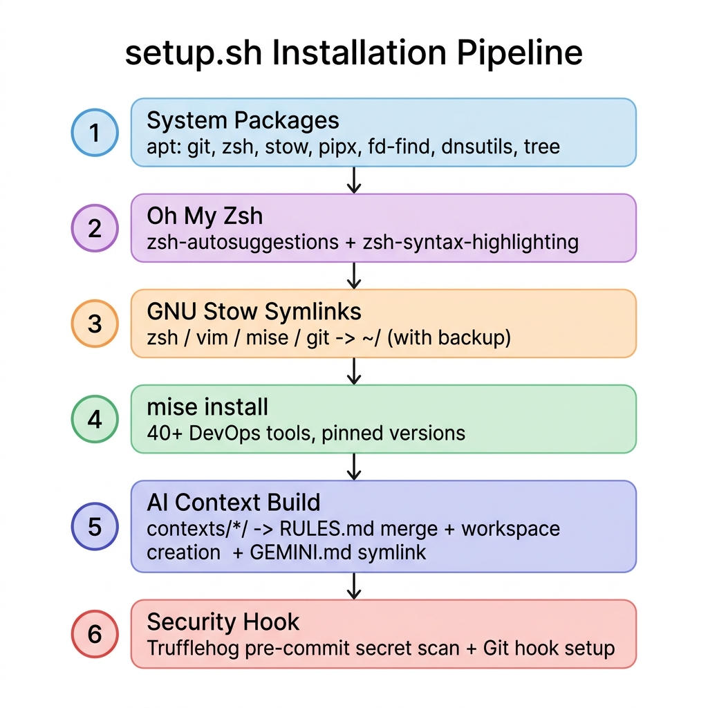
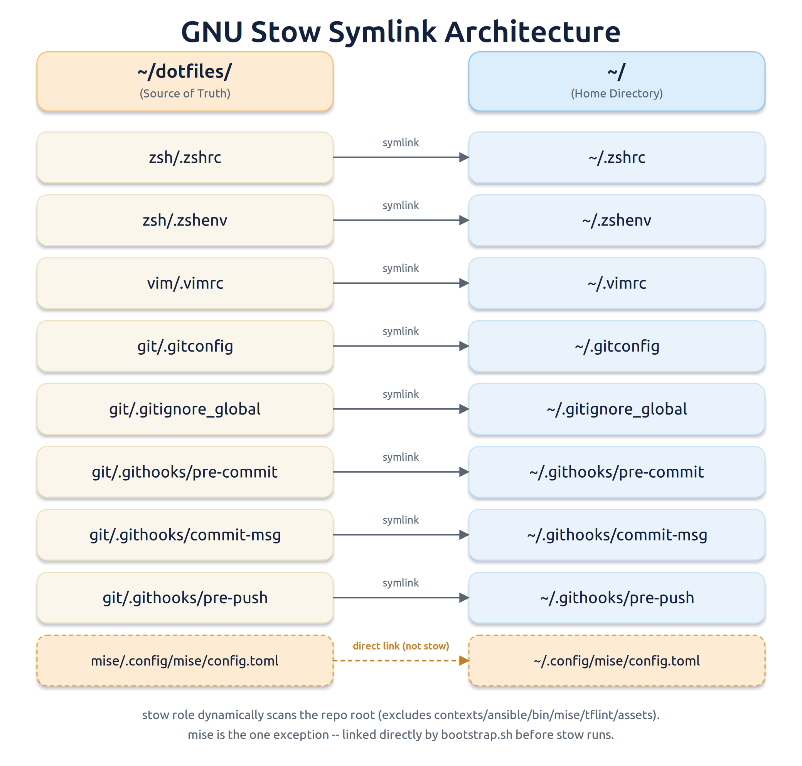
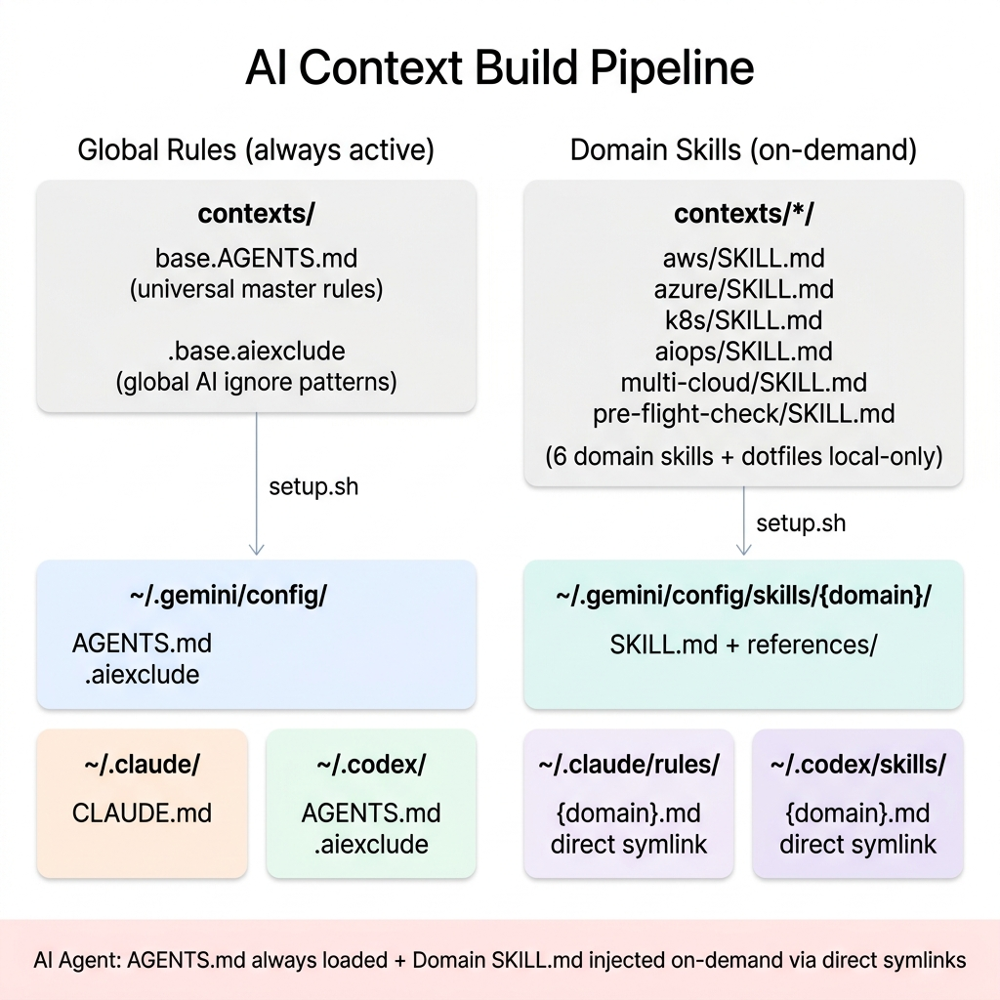

# Cloud Infrastructure Engineer Dotfiles & AI Brain

클라우드 인프라 엔지니어(Principal DevOps/SRE)를 위한 **로컬 작업 환경 자동 구성**과 **AI 자율 주행 프롬프트 아키텍처**를 하나의 레포지토리로 통합한 올인원 Dotfiles입니다.

단순 터미널 꾸미기를 넘어, **Zero-Trust 보안**, **도구 선언적 버전 관리**, 그리고 **AI(LLM)가 자율적으로 코드를 검증하고 인프라를 진단하는 에이전트 파이프라인**을 로컬 환경에 구축하는 것을 목표로 합니다.

---

## 목차

1. [핵심 기능](#핵심-기능)
2. [설치 가이드](#설치-가이드)
3. [디렉토리 구조](#디렉토리-구조)
4. [작동 논리 및 아키텍처](#작동-논리-및-아키텍처)
5. [포함된 도구 및 생산성 설정](#포함된-도구-및-생산성-설정)
6. [커스터마이징 및 확장](#커스터마이징-및-확장)

---

## 핵심 기능

### 1. Zero-Trust 보안 및 격리
- **글로벌 `.gitignore_global` 강제 적용:** `terraform.tfstate`, `.env`, `.pem` 키가 원격 저장소로 유출되는 사고를 시스템 전역에서 원천 차단합니다.
- **도구 완전 격리:** `mise`(런타임/CLI 도구)와 `pipx`(Python 기반 도구)를 통해 시스템 전역을 오염시키지 않고 선언적으로 버전을 관리합니다.
- **시크릿 히스토리 차단:** `HIST_IGNORE_SPACE` 설정으로 공백으로 시작하는 커맨드는 터미널 히스토리에 기록되지 않습니다.
- **로컬 시크릿 파일 분리:** API 키와 토큰은 Git이 추적하지 않는 `~/.zshrc.local`, `~/.gitconfig.local`에만 보관하도록 아키텍처를 강제합니다.

### 2. 고성능 사전 안전성 검증 파이프라인 (DX 최적화)
- **정적 분석 및 문법 검증:** `pre-flight-check.sh`가 스테이징된 변경 파일 종류에 맞춰 `shellcheck`/`shfmt`(쉘), `terraform fmt`/`tflint`/`checkov`(IaC 문법+보안 오구성), `ansible-lint`, `hadolint`(Dockerfile), `conftest`(OPA 정책) 등을 자동 실행합니다. K8s처럼 워크스페이스 전용 도구(`kyverno`, `promtool` 등)가 필요하면 `contexts/*/scripts/preflight/` 디렉토리를 자동 탐색해 위임 호출하므로, 그 디렉토리에 새 검증 스크립트를 넣는 것만으로 파이프라인이 확장됩니다. 위임 대상을 파일 이름이 아니라 위치로 판정하므로, 위임 대상이 아닌 스크립트가 이름만으로 딸려 들어가지 않습니다.
- **의존성 취약점 스캔 (소스 레벨):** `trivy fs --scanners vuln`이 저장소 내 의존성 매니페스트(requirements.txt 등)를 빌드 없이 스캔합니다. 매 커밋마다 이미지를 빌드해 스캔하면 속도 목표와 충돌하므로 소스 레벨로 제한했으며, 취약점은 경고만 남기고 커밋을 막지는 않습니다. 이미지 레이어 자체의 SBOM/취약점/서명은 커밋이 아니라 릴리즈 단계의 책임이며 `syft`/`grype`/`cosign`이 담당합니다.
- **FinOps 비용 게이트:** 커밋 전 `infracost breakdown` 결과에서 Extended Support/LTS(연장 지원) 추가 요금 항목을 탐지하면 커밋 자체를 차단하여, 의도치 않은 예산 초과를 소스에서 원천 방어합니다.
- **시맨틱 커밋 컨벤션 강제:** `commit-msg` 훅이 `feat/fix/docs/chore/...(scope): subject` 형식을 검사하여, 컨벤션을 지키지 않은 커밋 메시지는 자체적으로 차단합니다.
- **글로벌 훅:** `core.hooksPath`로 등록된 전역 훅이 `TruffleHog` 시크릿 스캔 후 위 검증을 실행합니다. 검증 스크립트는 저장소마다 링크를 두지 않고 `~/dotfiles`의 정본을 절대 경로로 직접 호출하므로, 개별 저장소에 훅이나 링크를 챙길 필요가 없습니다. 검증 대상은 `~/workspace` 하위 저장소와 `~/dotfiles` 자신이며, 그 밖의 저장소는 루트에 `pre-flight-check.sh` 링크를 둔 경우에만 검증합니다.
- **고속 DX 튜닝:** `Trivy` DB를 24시간 주기로 캐싱(`--skip-db-update`)하고 `find` 탐색에서 `.git/`, `.terraform/` 등을 `-prune`으로 제외하여, 커밋 지연을 20초에서 0.5초 수준으로 단축했습니다.

### 3. SOTA 에이전트 워크플로우 및 프롬프트 아키텍처
로컬 프롬프트 아키텍처에는 Andrew Ng의 Agentic Workflow 디자인 패턴, ReAct/ToT 등의 추론 아키텍처, 그리고 벤더별 공식 가이드를 반영한 고급 프롬프트 설계가 반영되어 있습니다.
이에 대한 상세한 설계 철학 및 기술적 배경은 [Agentic Workflow & Prompt Architecture](contexts/README.md) 문서를 참고하십시오.

### 4. AI Customization Architecture (AI 스킬 동적 주입)
개발자의 로컬 환경 편의성과 팀 Git 협업 순수성을 완전히 분리하면서 최신 AI 에이전트의 Customization Elements(Skills & Rules)를 완벽히 지원하는 독자적 아키텍처입니다.
- **글로벌 룰 자동 주입:** `setup.sh` 실행 시 코어 룰(`base.AGENTS.md`)이 제미나이 Customizations Root(`~/.gemini/config/AGENTS.md`)와 클로드 글로벌 룰(`~/.claude/CLAUDE.md`) 양쪽에 심볼릭 링크로 주입되고, 전역 무시 룰(`.base.aiexclude`)도 함께 배치됩니다.
- **도메인 스킬 글로벌 등록:** 환경별 특화 룰(`contexts/`)은 `~/.gemini/config/skills/<도메인>/SKILL.md` 및 `~/.claude/skills/<도메인>/SKILL.md` 심볼릭 링크로 글로벌 스킬 등록됩니다. AI는 폴더 이동 없이도 작업 맥락을 파악하여 최적의 도메인 스킬(예: aws, azure)을 스스로 호출합니다.
- **프로젝트 루트 단독 매핑:** 워크스페이스 최상단 루트에 `AGENTS.md`와 `CLAUDE.md` 심볼릭 링크를 단독 생성 및 전역 이그노어하여, 로컬 저장소 오염 없이 제미나이와 클로드 에이전트가 100% 무인식 룰 로딩을 지원합니다.
- **AI 편집 이력 자동 기록:** `agent-edits-hook.sh`가 두 에이전트의 `PostToolUse` 훅으로 등록되어, AI가 파일을 변경할 때마다 `<ISO8601> | <파일경로> | <출처> | <목적> | <결과>` 1줄을 그 프로젝트 루트의 `.agent-state/edits.log`에 누적합니다. 페이로드 스키마가 서로 다른 Claude Code(`tool_name`/`file_path`)와 Antigravity(`toolCall.name`/`TargetFile`)를 한 스크립트가 함께 처리하며, 로그 파일은 전역 이그노어 대상이라 어느 저장소도 오염시키지 않습니다. 이 기록은 프롬프트 자가 진화(`base.AGENTS.md` 9장)의 입력으로 사용됩니다.

### 5. 엔터프라이즈 AI 프롬프트 세트 내장 (`contexts/` 폴더)
워크스페이스별 특화 룰북과 메타 프롬프트에 적용된 구체적인 프롬프트 엔지니어링 기법(XML 격리, 계급제 우선순위 등)은 [Agentic Workflow & Prompt Architecture](contexts/README.md)에 상세히 명세되어 있습니다.

**워크스페이스별 특화 모듈 (🟢 Production만 표시):**

| 워크스페이스 | 모듈 수 | 주요 커버리지 |
|---|---|---|
| **AWS** (`aws/`) | 12개 (`005`~`100`) | 제로트러스트 보안, 자격증명 격리, FinOps, IaC(Terraform), EKS, Serverless, RDS, Day2 운영 및 사고 대응 |
| **Azure** (`azure/`) | 12개 (`005`~`100`) | 제로트러스트 보안, 자격증명 격리, FinOps, IaC(Terraform), AKS, Serverless, Database, Day2 운영 및 사고 대응 |
| **Dotfiles** (`dotfiles/`) | 10개 (`000`~`060`) | 인지 엔진, 계획서·핸드오프 설계도 작성 표준, 셸 스크립팅 표준, 툴체인 관리, 보안, 메타/범용 프롬프팅, 규칙 근거·승격 표준, 트러블슈팅 |

> K8s, Multi-Cloud, AIOps, Containers, Observability, Drawio-gen은 아직 튜닝 중인 🟡 Draft 워크스페이스입니다. 상세 커버리지는 [contexts/README.md](contexts/README.md)를 참고하십시오.

---

## 설치 가이드

> [!WARNING]
> **지원 OS**: Ubuntu / Debian 기반 Linux (또는 Windows WSL2 Ubuntu 환경)
> WSL2 사용 시, 반드시 Linux 네이티브 홈 디렉토리(`~/`) 하위에 클론하십시오. `/mnt/c/` 경로에서 실행하면 권한 오류가 발생하며 스크립트가 즉시 종료됩니다.

### Step 1. 저장소 클론
```bash
git clone https://github.com/iaminpwd/dotfiles.git ~/dotfiles
cd ~/dotfiles
```

### Step 2. 자동 설치 스크립트 실행
```bash
./setup.sh
```

스크립트는 다음 6단계를 순차적으로 실행합니다.

| 단계 | 작업 내용 |
|---|---|
| **[1/6]** 필수 패키지 & Docker 설치 | `apt`로 git, zsh, stow, pipx, dnsutils, tree 등 설치 + Docker Engine 자동 설치 및 `docker` 그룹 권한 부여 (`fd`는 apt 대신 `mise`로 통합 관리) |
| **[2/6]** Oh My Zsh 구성 | Oh My Zsh + `zsh-autosuggestions`, `zsh-syntax-highlighting` 플러그인 설치 |
| **[3/6]** Stow 심볼릭 링크 | 기존 설정 파일 백업 후, `zsh/vim/mise/git` 설정을 홈 디렉토리로 symlink |
| **[4/6]** mise 인프라 도구 설치 | `mise install`로 `~/.config/mise/config.toml`에 선언된 44개 데브옵스 도구 일괄 설치 |
| **[5/6]** AI 커스터마이징 구조 주입 | 글로벌 마스터 룰(`base.AGENTS.md`) 셋업, 루트 `AGENTS.md`/`CLAUDE.md` 링킹, Claude 커밋/PR Co-Authored-By 어트리뷰션 기본 비활성화, AI 편집 이력 훅(`agent-edits-hook.sh`)을 Claude Code·Antigravity 양쪽 `PostToolUse`에 병합 등록 |
| **[6/6]** 시크릿 보안 훅 | TruffleHog 전역 시크릿 스캔 + `git/.githooks/{pre-commit,commit-msg}`를 `core.hooksPath`로 등록하여 모든 로컬 저장소에 정적 분석·FinOps 게이트·시맨틱 커밋 검증 자동 적용 |

### Step 3. 터미널 재시작
```bash
exec zsh
# 또는 기존 터미널에서: src
```

### 성공 검증 커맨드
```bash
# mise 도구 설치 확인
mise ls

# Stow symlink 확인
ls -la ~/.zshrc ~/.gitconfig ~/.config/mise/config.toml

# AI 글로벌 룰 및 스킬 레지스트리 등록 확인
cat ~/.gemini/config/AGENTS.md | head -5
ls ~/.gemini/config/skills/
```

---

## 디렉토리 구조

```text
~/dotfiles
├── contexts/             # AI 컨텍스트 룰북 단일 진실 공급원 (SSOT)
│   ├── base.AGENTS.md         # 전 워크스페이스 공통 마스터 엔진 (SSOT)
│   ├── base.hooks.json        # Antigravity PostToolUse 훅 정의 템플릿 (setup.sh가 경로 치환 후 병합)
│   ├── .base.aiexclude        # 글로벌 AI 오염 방지 전역 무시 룰 원본
│   ├── README.md              # 프롬프트 아키텍처 백과사전
│   ├── aws/, azure/, dotfiles/            # 🟢 Production 워크스페이스 룰북
│   ├── k8s/, multi-cloud/, aiops/,
│   │   containers/, observability/,
│   │   drawio-gen/                        # 🟡 Draft 워크스페이스 룰북
│   ├── pre-flight-check/                  # 사전 검증 정본 스크립트 및 tf 픽스처 공용 테스트 라이브러리
│   │                                      #   (스킬별 위임 검증기는 각 스킬의 scripts/preflight/ 에 위치)
│
├── git/
│   ├── .gitconfig             # 글로벌 Git 설정 (alias, pull.rebase=true, hooksPath)
│   ├── .githooks/              # 전역 pre-commit·commit-msg 훅 원본 (Stow로 ~/.githooks/에 symlink)
│   └── .gitignore_global      # 시스템 전역 Git 무시 규칙 (tfstate, .env 등)
│
├── mise/
│   └── .config/mise/
│       └── config.toml   # 인프라 도구 버전 선언 매니페스트 (SSOT, mise 전역 설정 위치)
│
├── vim/
│   └── .vimrc            # Vim 설정 (클립보드 연동, YAML 2칸 탭)
│
├── zsh/
│   ├── .zshenv           # Zsh 환경변수 설정 (PATH 등 비대화형 세션 포함)
│   └── .zshrc            # Zsh 설정 (Oh My Zsh, 단축어)
│
├── .gitignore            # dotfiles 레포 자체 Git 무시 규칙
├── README.md             # 본 문서
└── setup.sh              # 전체 환경 자동 구성 스크립트 (set -euo pipefail)
```

---

## 작동 논리 및 아키텍처

### setup.sh 설치 파이프라인


### GNU Stow 심볼릭 링크 구조


**글로벌 스킬 적용**
모든 도메인 스킬은 `~/.gemini/config/skills/`, `~/.claude/skills/` 심볼릭 링크 레지스트리를 통해 AI 에이전트에게 직접 라우팅되므로, **로컬 소스코드 저장소가 100% 깔끔하게 유지**됩니다.

### AI 컨텍스트 빌드 파이프라인


> `pre-flight-check.sh`의 검증 항목 및 DX 튜닝 상세는 [핵심 기능 §2](#핵심-기능)를 참고하십시오.

---

## 포함된 도구 및 생산성 설정

### 1. `config.toml` 선언 도구 목록 (버전 고정, 46개)
시스템 전역을 오염시키지 않고 `mise`와 `pipx`를 통해 안전하게 격리 설치됩니다.

**보안 & 정책 검증**
`trivy` · `conftest` · `cosign` · `trufflehog` · `shellcheck` · `shfmt` · `checkov` · `yamllint`

**컨테이너 이미지 공급망 (SBOM/취약점/레이어 분석)**
`syft` · `grype` · `dive`

**관측성 (Observability)**
`loki-logcli`

**IaC & 구성 관리**
`terraform` · `terragrunt` · `tflint` · `terraform-docs` · `infracost` · `ansible` · `ansible-lint`

**클라우드 CLI**
`awscli` · `azure-cli` · `aws-sam-cli` · `bicep` (Ubuntu glibc 호환을 위해 `github:` 백엔드로 고정 설치)

**Kubernetes & 컨테이너**
`kubectl` · `kubectx` · `k9s` · `helm` · `kustomize` · `kube-linter` · `hadolint` · `helm-docs` · `kyverno` · `pluto` · `promtool` · `yq`

**로컬 테스트**
`k3d` · `act`

**런타임**
`node` · `python` · `go`

**CLI 유틸리티**
`fzf` · `jq` · `bat` · `fd`

> 버전 고정 정보는 [`mise/.config/mise/config.toml`](mise/.config/mise/config.toml)에서 확인하십시오.

### 2. 생산성 단축어 (Alias)
자주 사용하는 인프라 명령어 단축 별칭(`k` -> `kubectl`, `tf` -> `terraform`, `ap` -> `ansible-playbook` 등)이 `zsh/.zshrc`와 `git/.gitconfig`에 구성되어 개발자 생산성을 극대화합니다.

### 3. 로컬 시크릿 파일 (`~/.zshrc.local`)
API 키, 토큰 등 민감 정보는 `.zshrc` 대신 `setup.sh` 실행 후 자동 생성되는 `~/.zshrc.local`에 물리적으로 격리하여 보관하십시오. 이 파일은 `.gitignore`에 의해 원격 저장소에 절대 커밋되지 않습니다.

```bash
# ~/.zshrc.local 예시
export GITHUB_TOKEN="ghp_..."
export AWS_ACCESS_KEY_ID="AKIA..."
export OPENAI_API_KEY="sk-..."
```

### 4. Vim 생산성 최적화 (`.vimrc`)
- **클립보드 연동:** `set clipboard=unnamedplus` — 브라우저, Slack과 양방향 복사/붙여넣기
- **YAML 최적화:** 탭 간격 2칸 고정 (`tabstop=2`, `shiftwidth=2`)

---

## 커스터마이징 및 확장

### 도구 추가 / 버전 변경
`mise/.config/mise/config.toml` 파일에서 버전을 수정한 후 아래 커맨드를 실행하십시오.
```bash
# 사용 가능한 버전 목록 조회
mise ls-remote terraform

# config.toml 수정 후 일괄 설치
mise install

# 설치 결과 확인
mise ls
```

### 단축어 추가
`zsh/.zshrc`에 alias를 추가한 후 `src`를 실행하면 즉시 적용됩니다.
```bash
echo "alias myalias='my-command'" >> ~/dotfiles/zsh/.zshrc
src
```

### AI 룰셋 핫 리로드 (Zero-Config)
이미 셋업된 도메인 스킬의 세부 규칙을 수정하거나 확장할 경우, `setup.sh` 재실행 없이 `contexts/` 하위의 마크다운 파일을 수정하는 즉시 실시간으로 에이전트에 반영됩니다.

> [!NOTE]
> `setup.sh`는 `contexts/` 하위의 모든 디렉토리를 자동 순회합니다. 새 도메인 디렉토리를 추가하고 스크립트를 재실행하기만 하면, AI 에이전트의 글로벌 레지스트리(`~/.gemini/config/skills/`, `~/.claude/skills/`)에 스킬이 자동으로 등록되어 모든 로컬 환경에서 즉시 활용 가능해집니다.

---

## 보류 중인 후보 도구 (미적용)

지금 당장 필요하다고 확인된 게 아니라서 아직 `mise/.config/mise/config.toml`에 넣지 않은 도구들입니다. 아래 조건에 실제로 부딪히면 그때 해당 도구만 추가하십시오.

| 도구 | 역할 | 추가할 조건 |
|---|---|---|
| `aws-vault` (또는 `granted`) | AWS SSO/역할별 자격증명 격리 | 여러 AWS 계정·역할을 자주 오가며 프로필 전환이 번거로워질 때 |
| `session-manager-plugin` | 베스천/SSH 없이 `aws ssm start-session`으로 EC2 접속 | 프라이빗 서브넷 EC2에 SSH로 직접 접속하는 일이 반복될 때 |
| `cloud-nuke` | 샌드박스 계정에 방치된 리소스 일괄 정리 | 테스트용으로 띄운 리소스를 지우는 걸 깜빡해 비용이 새기 시작할 때 |
| `stern` | K8s 파드 로그 다중 tail | `k9s`로는 부족할 만큼 로그 스트리밍/디버깅을 자주 할 때 |

> LocalStack은 후보에서 제외했습니다. IaC 검증은 이미 `terraform plan` + `checkov`/`conftest`로 커밋 전에 걸러지고, 실제 apply는 로컬 에뮬레이션보다 격리된 샌드박스 AWS 계정에서 하는 쪽이 현업에서 더 신뢰받는 방식이기 때문입니다.
