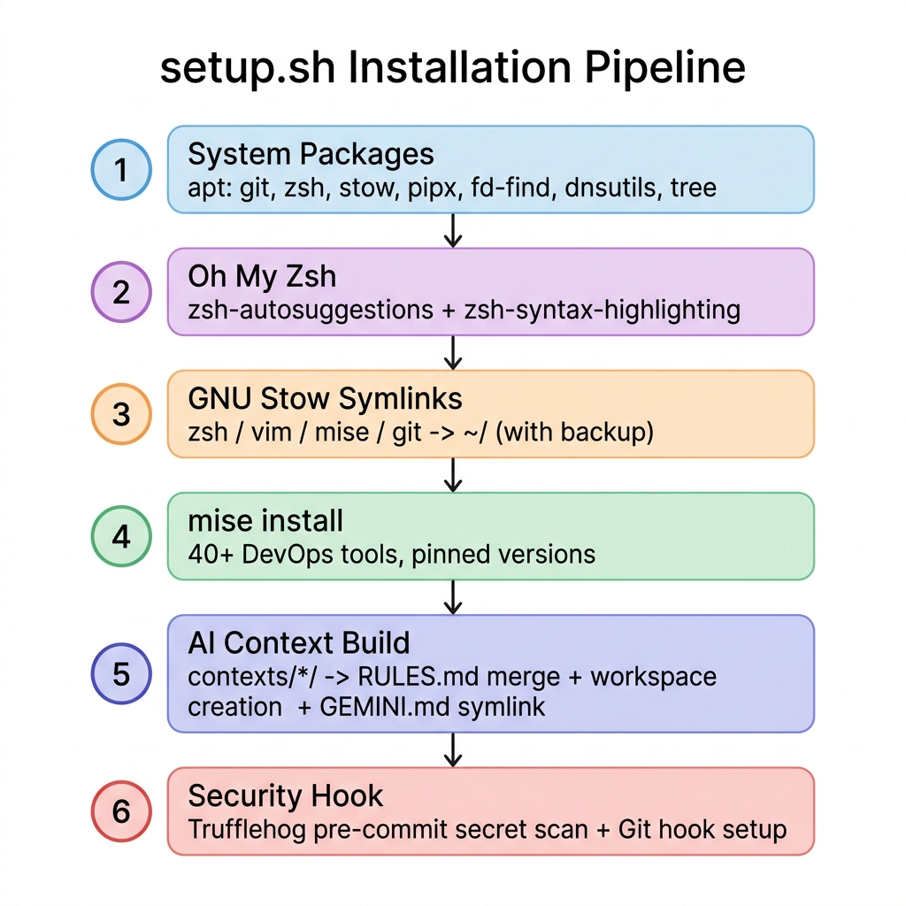
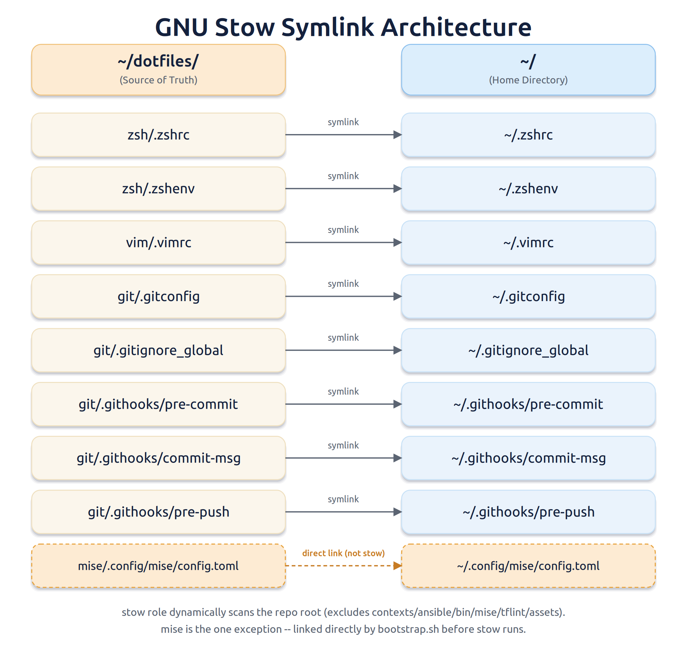
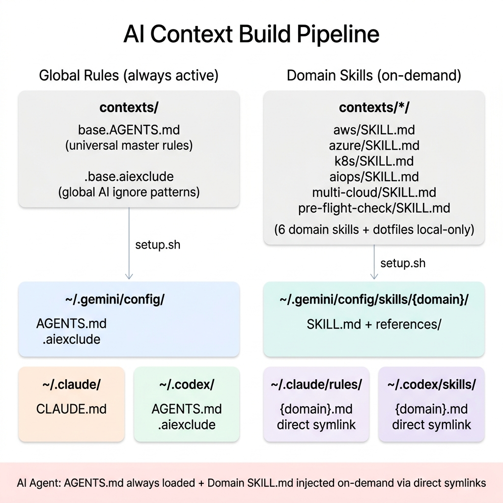

# Cloud Infrastructure Engineer Dotfiles

클라우드 인프라 작업용 로컬 개발 환경과 AI 에이전트의 검증 도구를 관리하는 저장소입니다. `bootstrap.sh`가 mise·Just·Ansible을 준비하고, Stow가 셸·Git·도구 설정을 심볼릭 링크로 배포합니다.

## 핵심 기능

- **설치·복구:** `bootstrap.sh` → `Justfile` → `ansible/site.yml` 순서로 실행하며, 기존 사용자 파일은 백업하거나 충돌을 보고합니다.
- **설정의 단일 원본:** 도구와 버전은 [`stow/mise/.config/mise/config.toml`](stow/mise/.config/mise/config.toml), 셸·Git 설정은 `stow/`에서 관리합니다.
- **검증:** Git 훅, `bin/hooks/pre-flight-check.sh`, `just verify`로 문법·시크릿·회귀 검사를 실행합니다. 도메인별 IaC/보안 정책 검사는 `just check-domain`을 명시해야 합니다.
- **AI 에이전트:** 공통 지침은 `contexts/base.AGENTS.md`, 도메인 지침은 `contexts/*/SKILL.md`가 원본입니다. 스킬·참조 파일은 에이전트에 링크하고, 테스트와 평가 데이터는 설치하지 않습니다.

자세한 실행·검증 계약은 [bin 도구 안내](bin/README.md), [contexts 안내](contexts/README.md)와 [스킬 색인](contexts/INDEX.md)을 참고하십시오. 같은 계약을 README에 중복 기재하지 않습니다.

---


## 설치 가이드

> [!WARNING]
> **지원 OS**: Debian 계열(`apt-get`) · RHEL 계열(`dnf`) · macOS(`brew`)
> `bootstrap.sh`가 실행 시점에 패키지 매니저를 판별해 분기하며, 지원 목록에 없는 환경에서는 즉시 중단됩니다.
>
> **macOS**: 선행 조건은 Homebrew 하나뿐이며 별도 준비물은 없습니다. `bootstrap.sh`는 macOS 기본 bash(3.2)에서 그대로 실행되도록 유지되고(회귀 테스트로 강제), 실행 중에 필수 런타임과 `mise`·`just`·`ansible`을 구성합니다.
> WSL2 사용 시, 반드시 Linux 네이티브 홈 디렉토리(`~/`) 하위에 클론하십시오. `/mnt/c/` 경로에서 실행하면 권한 오류가 발생하며 스크립트가 즉시 종료됩니다.

### Step 1. 저장소 클론
```bash
git clone https://github.com/iaminpwd/dotfiles.git ~/dotfiles
cd ~/dotfiles
```

### Step 2. 자동 셋업 스크립트 실행
```bash
# 실제 적용 (경량 bootstrap.sh 실행 -> mise install 및 just setup / Ansible 자동 실행)
./bootstrap.sh

# 만약 Ansible 변경 사항을 미리 확인하고 싶을 때 (Dry-run)
just setup-dryrun
```

`bootstrap.sh`는 경량 진입점으로서 필수 패키지 및 `mise`, `just`, `ansible`을 준비한 후 제어권을 `Justfile` 및 Ansible Playbook(`ansible/site.yml`)으로 넘겨 모듈화된 셋업을 완료합니다.

`just setup`(Ansible Playbook)은 아래 6개 역할을 순차적으로 실행합니다:

| 역할 (Ansible Role) | 작업 내용 |
|---|---|
| **`packages`** | OS 패키지 매니저(`apt`/`dnf`/`brew`)로 git, zsh, stow 등 필수 툴체인 및 개발 유틸리티 일괄 설치 |
| **`docker`** | Docker Engine을 공식 저장소에 등록해 설치하고 사용자 그룹 권한 구성 (macOS는 Docker Desktop 설치 안내) |
| **`stow`** | 기존 설정 파일 안전 백업 후 `zsh`, `vim`, `git`, `tflint`, `mise` 설정을 홈 디렉토리(`~/`)에 파일 단위로 안전하게 링크. 최초 `bootstrap.sh`는 저장소의 mise 설정을 환경변수로 읽어 도구를 설치한 뒤 동일한 안전 설치기를 사용합니다. |
| **`zsh`** | Oh My Zsh 및 `zsh-autosuggestions`, `zsh-syntax-highlighting` 플러그인 구성 |
| **`ai_agent`** | 글로벌 룰·스킬 및 워크스페이스 링크 배포, AI 편집 이력 훅과 변경 감지 기반 Stop 검사 등록, 이전 실시간 검사 등록 제거 |
| **`tflint`** | IaC 전역 `tflint` 설정(`stow/tflint/.tflint.hcl`)의 플러그인 초기화(`tflint --init`)만 담당 — `~/.tflint.hcl` 배포 자체는 위 `stow` 역할이 수행 |

### Step 3. 터미널 재시작
```bash
exec zsh
# 또는 기존 터미널에서: src
```

### 성공 검증 커맨드
```bash
# mise 도구 설치 확인
mise ls

# Stow symlink 확인
ls -la ~/.zshrc ~/.gitconfig ~/.vimrc ~/.tflint.hcl ~/.config/mise/config.toml

# AI 글로벌 룰 및 스킬 레지스트리 등록 확인
cat ~/.gemini/config/AGENTS.md | head -5
ls ~/.gemini/config/skills/
readlink -f ~/.codex/AGENTS.md
ls ~/.agents/skills/

# 통합 사전 검증 및 테스트 통과 확인 (Justfile 활용)
just check     # pre-flight-check.sh --all: 저장소 전체 파일에 shellcheck/tflint/checkov 등 정적 분석
just test      # contexts/*/tests/run.sh 전체: 각 검사 스크립트가 ok/fail 픽스처를 올바르게 판정하는지 회귀 테스트
just verify    # 위 두 개 + prompt-lint.sh + 테스트 등록 검사를 run-suite.sh로 한 번에 실행 (가장 종합적인 검증, 코드 수정 후 최종 확인용)
```

마지막 줄에 `❌`가 하나도 없고 `-> [✓] <경로>`만 쌓여 있으면 통과입니다. 실패한 항목만 원형 로그가 그대로 남으므로 그 부분만 읽으면 됩니다.

---

## 디렉토리 구조

```text
dotfiles/
├── bootstrap.sh          # 최초 설치 진입점
├── Justfile              # setup/check/test/verify/docs-index
├── ansible/              # site.yml 및 설치 역할 6개
├── stow/                 # zsh/git/vim/tflint/mise 설정 원본
├── bin/
│   ├── hooks/            # Git·에이전트 훅, 검증 러너, 도메인 플러그인
│   ├── linters/          # 정적 검사·정책 검사
│   ├── lib/              # 공유 셸 라이브러리
│   └── utils/            # 설치·링크·백업 도구
├── contexts/
│   ├── base.AGENTS.md    # 글로벌 지침 원본
│   ├── INDEX.md          # 스킬 라우팅 색인
│   └── <skill>/          # SKILL.md, 필요시 references/scripts/tests
├── tests/lib/            # 스킬 간 공유 테스트 유틸리티
├── assets/               # 아래 아키텍처 이미지
└── .github/              # CI·Renovate·검증 헬퍼
```

도메인별 스킬 목록과 참조 문서는 [contexts/INDEX.md](contexts/INDEX.md), 도구별 호출법은 [bin/README.md](bin/README.md)에 있습니다. `contexts/*/tests/`는 CI·회귀 테스트용 자산이므로 런타임 스킬에 배포하지 않습니다.

---


## 작동 논리 및 아키텍처

### bootstrap.sh & Ansible 설치 파이프라인


### GNU Stow 심볼릭 링크 구조


**글로벌 스킬 적용**
dotfiles를 제외한 도메인 스킬은 `~/.gemini/config/skills/`, `~/.claude/skills/`, `~/.agents/skills/`(Codex) 심볼릭 링크 레지스트리를 통해 AI 에이전트에게 직접 라우팅되므로, **로컬 소스코드 저장소가 100% 깔끔하게 유지**됩니다.

### AI 컨텍스트 빌드 파이프라인


> `bin/hooks/pre-flight-check.sh`의 검증 항목 및 DX 튜닝 상세는 [핵심 기능 §2](#핵심-기능)를 참고하십시오.

---

## 포함된 도구 및 생산성 설정

- **도구 버전:** [`stow/mise/.config/mise/config.toml`](stow/mise/.config/mise/config.toml)이 유일한 선언 원본입니다. `mise install`로 적용하고 `mise ls`로 확인합니다. 고정 도구 목록을 README에 별도로 복사하지 않습니다.
- **Shell / Git:** `stow/zsh/.zshrc`, `stow/zsh/.zshenv`, `stow/git/.gitconfig`, `stow/vim/.vimrc`에서 원본을 관리합니다.
- **개인 시크릿:** `~/.zshrc.local`과 `~/.gitconfig.local`은 저장소 밖에 두고 Git에 커밋하지 않습니다. `~/.zshrc.local`은 `chmod 600 ~/.zshrc.local`로 권한을 제한합니다.
- **전역 훅:** `stow/git/.githooks/`가 Git 훅 원본이며, AI 훅 등록은 `bin/utils/merge-agent-hooks.sh`가 사용자 설정을 보존하며 병합합니다.

---


## 커스터마이징 및 확장

도구를 추가하거나 버전을 변경하면 `stow/mise/.config/mise/config.toml`을 수정한 뒤 `mise install`을 실행합니다. Zsh 별칭은 `stow/zsh/.zshrc`에서 관리하며 개인별 시크릿·설정은 `.zshrc.local`에 분리합니다.

이미 링크로 배포된 스킬·reference 파일의 **내용만 변경**할 때는 재설치가 필요하지 않습니다. 스킬이나 에셋 파일을 새로 추가·삭제한 경우에는 `just setup`으로 링크 집합을 갱신하고 설치 검증도 확인해야 합니다.

### 검사 시점

| 시점 | 실행 범위 |
|---|---|
| 커밋 | 시크릿 검사, `PFC_PROFILE=quick` 등 빠른 검사 |
| AI Stop (Claude/Antigravity/Codex) | 변경 감지 후 공통 `PFC_PROFILE=stop` 및 선택적 회귀 검사 (Codex는 /hooks 신뢰 필요) |
| 푸시 | 기본 회귀 검사 생략; 필요한 경우 `DOTFILES_PRE_PUSH=1 git push` |
| CI | `PFC_PROFILE=full just verify`와 조건별 bootstrap smoke |
| 수동 전체 도메인 | `just check-domain`으로 Terraform/SAM/K8s 등 추가 정책 검사 |

주간·수동 CI 또는 설치 경로 영향 변경 시 bootstrap smoke를 실행합니다. 상세 검증 조건·WARNING/SKIP 의미는 [pre-flight-check 스킬](contexts/pre-flight-check/SKILL.md)과 [bin 도구 안내](bin/README.md)에 있습니다.

---


## 작업 환경 복구와 업데이트

이 저장소는 추적한 설정과 도구를 재설치합니다. 인증 정보, `.local` 파일 내용,
작업 저장소의 미커밋 변경, Docker 볼륨과 데이터베이스 데이터는 별도 백업 대상입니다.

### 새 PC에서 복구

1. 저장소를 최종 위치에 복제한 뒤 `./bootstrap.sh`를 실행합니다. 링크가 원본을
   가리키므로 설치 후 저장소를 이동했다면 새 위치에서 다시 실행합니다.
2. `.gitconfig.local`의 사용자 정보와 필요한 `.zshrc.local` 내용을 개인 백업에서
   복원합니다. 시크릿 백업은 암호화된 저장소에 보관하며 Git에 추가하지 않습니다.
   `.zshrc.local` 권한은 `chmod 600 ~/.zshrc.local`로 제한합니다.
3. GitHub·AWS·기타 서비스는 필요한 계정으로 다시 인증합니다. macOS 컨테이너
   런타임과 IDE 등 자동 설치에 포함되지 않은 앱도 복원합니다.
4. `exec zsh` 후 `bash .github/scripts/verify-bootstrap-env.sh`로 설치 상태를 확인합니다.
   이 검사는 실제 에이전트의 스킬 선택이나 인증 성공을 보장하지 않습니다.

### 기존 PC 업데이트

변경을 검토한 뒤 저장소를 갱신하고 `./bootstrap.sh`를 실행하면 도구와 링크를
재적용합니다. Zsh 본체·플러그인은 고정된 선언 버전으로 갱신되며, 해당 체크아웃에
직접 수정한 파일이 있다면 강제 삭제하지 않고 Ansible이 충돌을 보고합니다.
개인 커스터마이징은 `.zshrc.local` 또는 별도 플러그인으로 분리합니다.

이미 도구가 설치됐다면 아래처럼 필요한 역할만 적용할 수 있습니다.

```bash
bash bin/utils/run-setup.sh --check --tags stow,ai
bash bin/utils/run-setup.sh --tags stow,ai
```

`mise install`은 선언된 전체 도구를 설치합니다. 도구를 삭제하거나 새 설치 프로필을
추가할 때는 실제 사용 여부와 검사 의존성을 먼저 확인합니다.

### 기존 파일과 권한 정책

설치 충돌 백업은 원래 파일 옆의 `.backup.<시각>` 또는 `.bak.*`에 있습니다.
복원 전 현재 링크와 백업 대상을 확인하고, 필요한 파일 하나씩 복원합니다.
훅 설정 백업에는 개인 설정이 포함될 수 있으므로 공유 저장소에 넣지 않습니다.

bootstrap은 시스템 sudo 구현이나 sudoers 정책을 변경하지 않습니다. 일반 터미널의
Ansible 실행은 시작 시 become 비밀번호를 요청합니다. 비대화형 환경에는 미리 준비된
권한 설정이 필요하며, 권한이 없으면 실패합니다. sudo-rs와 classic sudo가 함께 있으면
이번 Ansible 실행에만 classic sudo를 사용합니다. 다른 실행 파일은
`ANSIBLE_BECOME_EXE`로 지정할 수 있습니다.

이전 bootstrap이 만든 `/etc/sudoers.d/99-dotfiles-<사용자>-shared-timestamp`는
자동 삭제하지 않습니다. 원복하려면 관리자 세션에서 해당 파일이 이 저장소가 만든
`Defaults:<사용자> !tty_tickets`만 담고 있는지 확인하고 백업한 뒤 제거하고,
`sudo visudo -c`로 전체 설정을 검사합니다. 기존 sudo 구현 전환도 배포판의
대체 실행 파일 설정을 확인한 뒤 별도로 원복합니다.

### Git·AI 설정의 공유 범위

전역 ignore는 시크릿·캐시·개인 설정을 제외합니다. `.terraform.lock.hcl`,
`AGENTS.md`, `CLAUDE.md`, `.claude/settings.json`, `.agents/skills/`는 팀과 공유할 수 있습니다.
이 저장소가 생성하는 루트 룰 링크는 저장소의 `.gitignore`에서만 제외합니다.
다른 프로젝트의 개인용 링크는 그 프로젝트의 `.git/info/exclude`에 등록합니다.

전역 Git 훅은 모든 저장소에 적용됩니다. 프로젝트가 별도 훅 시스템을 사용하면
그 프로젝트의 `core.hooksPath` 설정과 통합 여부를 확인합니다. 이 저장소 전용
검사는 현재 저장소와 실행 스크립트 원본의 실제 경로를 비교해 판정합니다.
디렉토리 이름을 바꾸거나 심볼릭 링크를 통해 실행해도 같은 원본을 식별합니다.

라우팅 정답지 검사는 무료이며 `bash contexts/prompt-architect/evals/routing/run.sh --check-cases-only`로 실행합니다. 실제 모델 측정은 별도 요청이 있을 때만 실행합니다.
